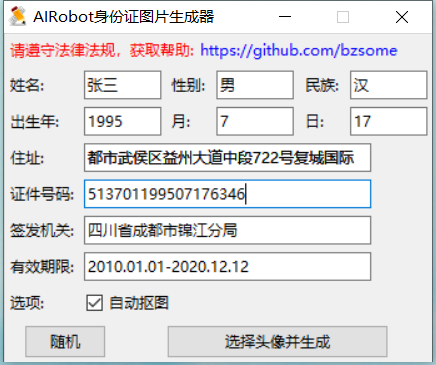
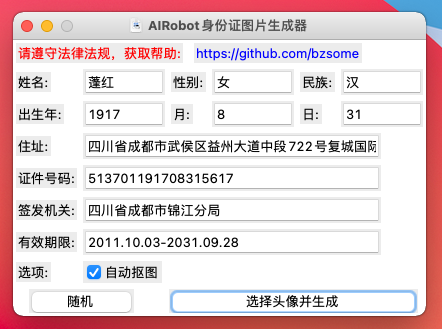
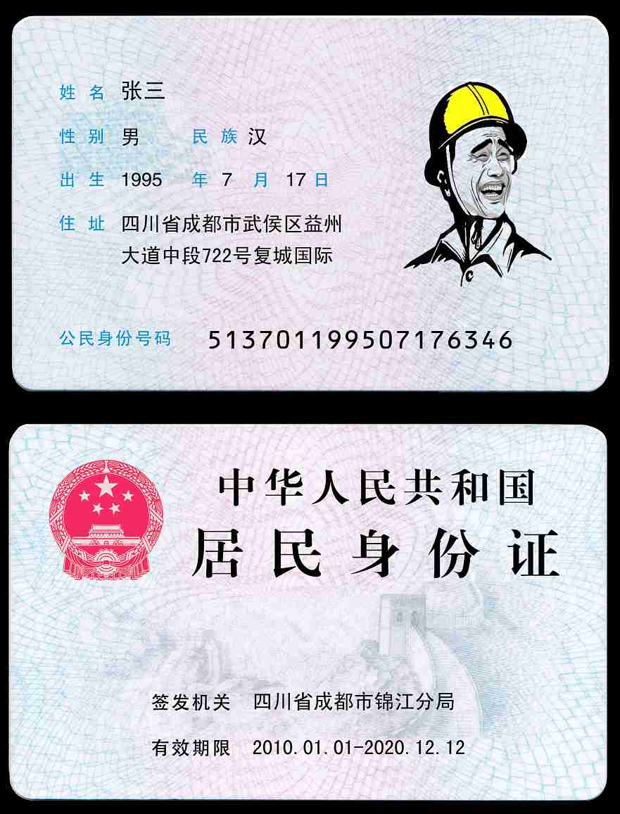

# 身份证图片构造器 idcard_generator

【仅做研究使用，请遵守当地法律法规，法律后果自负】

身份证图片生成工具,填入信息，选择一张头像图片,即可生成黑白和彩色身份证图片。

可以选择是否自动抠图，自动抠图目前仅支持纯色背景，对自动抠图效果不满意可以手动抠图。

在线抠图地址: (https://burner.bonanza.com/) (https://www.gaoding.com/koutu)

## 直接下载程序

-

身份证构造器Windows版： [idcard_generator_win64.exe](https://github.com/bzsome/idcard_generator/releases/download/v1.1.0/idcard_generator_win64_1.1.0.exe)

-

身份证构造器Macos版：[idcard_generator_macos.zip](https://github.com/bzsome/idcard_generator/releases/download/v1.1.0/idcard_generator_macos_1.1.0.zip)

- 注意：macos版本启动大约需要时间70s，测试支持系统Macos 11

## 运行效果图

- 程序主界面（windows）



- 程序主界面（Macos）



- 生成结果示例



## 更新记录:

- 自动改变头像大小
- 自动从纯色背景中抠图
- 随机生成身份信息(姓名，出生日期，身份证号)
- 固定依赖版本(防止高版本不兼容)
- 生成图片时显示处理弹窗

## 软件环境

- python3.7
- numpy
- pillow
- opencv

## 源码安装

```shell
cd .venv
cd Scripts
activate.bat
cd ../../
python3 -m pip install --upgrade pip
# 下载依赖
pip install .
```

## 打包程序

- build-dev.bat

开始打包，快速测试打包功能是否正常，不打包成单个文件

- build-test.bat

测试打包，基本与release一致，不进行upx压缩

- build-release.bat

发布打包，用于发布

## 打包性能对比

| 打包方式   | 打包命令                                         | 压缩方式  | 文件大小     | 启动+旋转时间 |
|--------------|----------------------------------------------|-------|----------|---------|
| release      | --onefile(禁用UPX)                             | Nuitka 自带 zstd 压缩	 | 52,393KB | 2s+4s   |
| release-upx  | --onefile + --upx                            | 双重压缩		 | 52,393KB | 2s+4s |
| release-upxn | --onefile + --upx + --onefile-no-compression | UPX 单次压缩 | 48,451KB | 7s+0s   |


## 参照标准：

- 正面

左上角为国徽，用红色油墨印刷;其右侧为证件名称“中华人民共和国居民身份证”，分上下两排排列，其中上排的“中华人民共和国”为4号宋体字，下排的“居民身份证”为2号宋体字;“签发机关”、“有效期限”为6号加粗黑体字;签发机关登记项采用，“xx市公安局”;有效期限采用“xxxx.xx-xxxx.xx.xx”格式，使用5号黑体字印刷，全部用黑色油墨印刷。

- 背面

“姓名”、“性别”、“民族”、“出生年月日”、“住址”、“公民身份号码”为6号黑体字，用蓝色油墨印刷；登记项目中的姓名项用5号黑体字印刷；其他项目则用小5号黑体字印刷；出生年月日
方正黑体简体字符大小：姓名＋号码（11点）其他（9点）字符间距（AV）：号码（50）字符行距：住址（12点）；身份证号码字体 OCR-B 10 BT 文字
华文细黑。
